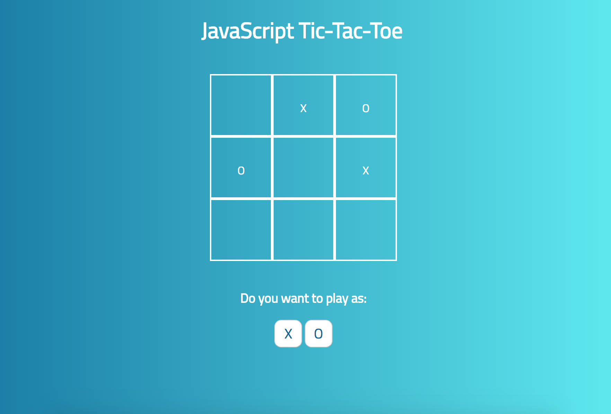

# Tic - Tac - Toe Game

This is my implementation of the penultimate freeCodeCamp challenge for the Front End Development Certification.

You can play the game here:
https://alaskaa.github.io/fcc-tictactoe/

In this game, a human and an AI player play the famous Tic-Tac-Toe Game against each other. As the human player you can choose whether you want to play as "X" or "O" and you will be prompted to make your first choice on the board. At the end of the game, a prompt is displayed telling you whether you lost, won or whether it was a draw!

